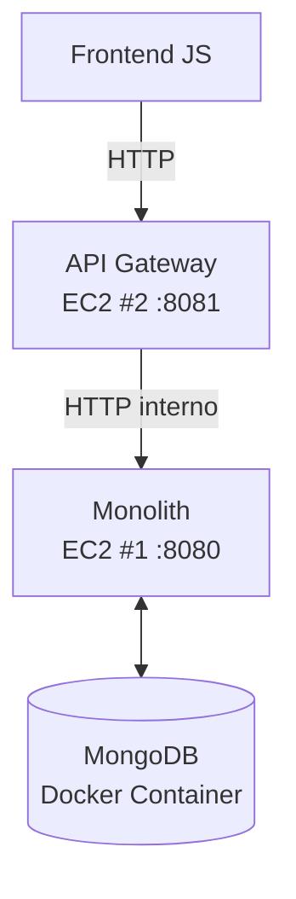

# 🧭 Arrival List Application – Taller de Virtualización y Docker (AYGO)

## 📘 Descripción General
Este proyecto implementa una aplicación distribuida que permite registrar y consultar llegadas (“arrivals”) de usuarios.  
La arquitectura está dividida en **tres componentes principales** desplegados sobre **AWS EC2** utilizando **Docker**:

- 🧱 **Monolith (Backend)**: Aplicación Java con Spring Boot que gestiona la lógica de negocio y persiste la información en MongoDB.  
- 🚪 **API Gateway (Facade)**: Aplicación Spring Boot que actúa como intermediario entre el frontend y el monolito.  
- 🌐 **Frontend**: Aplicación HTML + JavaScript que permite registrar nombres y listar los registros de llegada (ejecutada localmente).  

---

## 🏗️ Arquitectura



- **Comunicación:** HTTP interno entre EC2s mediante IP privada.  
- **Persistencia:** MongoDB en contenedor Docker.  
- **Despliegue:** Docker Compose para monolito + Mongo.  

---

## ⚙️ Tecnologías Utilizadas
- **Java 17 / Spring Boot 3**
- **MongoDB**
- **Docker / Docker Compose**
- **AWS EC2 (Amazon Linux 2)**
- **Nginx (para frontend local opcional)**
- **Fetch API (frontend JS)**

---

## 🧩 Componentes y Despliegue

### 1️⃣ [Monolito](https://github.com/Andresariz88/AYGO_arrival_monolith) + MongoDB
**Ubicación:** EC2 #1  
**Puerto expuesto:** `8080`  
**Docker Compose utilizado:**

```yaml
version: '3.8'
services:
  mongo:
    image: mongo:latest
    container_name: mongo
    ports:
      - "27017:27017"
    volumes:
      - mongo_data:/data/db

  monolith:
    image: andresariz88/arrival-monolith:latest
    container_name: monolith
    ports:
      - "8080:8080"
    depends_on:
      - mongo
    environment:
      - SPRING_DATA_MONGODB_URI=mongodb://mongo:27017/arrivaldb

volumes:
  mongo_data:
```

**Comandos ejecutados en EC2:**
```bash
sudo yum update -y
sudo systemctl start docker
sudo systemctl enable docker
sudo usermod -aG docker ec2-user
# Cerrar sesión y volver a entrar

# Ejecutar los contenedores
docker-compose up -d
```

**Verificación:**
```bash
docker ps
curl http://localhost:8080/api/arrivals
```

---

### 2️⃣ [API Gateway](https://github.com/Andresariz88/AYGO_arrival_api_gw)
**Ubicación:** EC2 #2  
**Puerto expuesto:** `8081`  

**Comando de despliegue:**
```bash
docker run -d -p 8081:8081   -e MONOLITH_URL=http://<IP_MONOLITO>:8080   andresariz88/arrival-apigateway:latest
```

**Verificación:**
```bash
curl http://<IP_MONOLITO>:8080/api/arrivals
curl http://localhost:8081/api/arrivals
```

---

### 3️⃣ [Frontend](https://github.com/Andresariz88/AYGO_arrival_frontend) (local)
**Ejecución local:**  
Abrir `index.html` y verificar que el `fetch()` apunte al API Gateway:
```js
fetch("http://<IP_PUBLICA_GATEWAY>:8081/api/arrivals")
```

Luego abrir el archivo en el navegador (`file:///.../index.html`) y probar.

---

## 🧪 Pruebas de Funcionamiento

- **Registro de Arrival:**  
  En el frontend, escribir un nombre → clic en “Submit” → se envía un `POST` al API Gateway.  
- **Consulta de Arrivals:**  
  Los nombres registrados aparecen listados inmediatamente (vía `GET /api/arrivals`).

---

## 🚀 Comandos Rápidos

**Construir imágenes:**
```bash
docker build -t andresariza/arrival-monolith:latest .
docker build -t andresariza/arrival-apigateway:latest .
```

**Subir imágenes a Docker Hub:**
```bash
docker push andresariza/arrival-monolith:latest
docker push andresariza/arrival-apigateway:latest
```

**Levantar entorno completo (EC2 #1):**
```bash
docker-compose up -d
```

